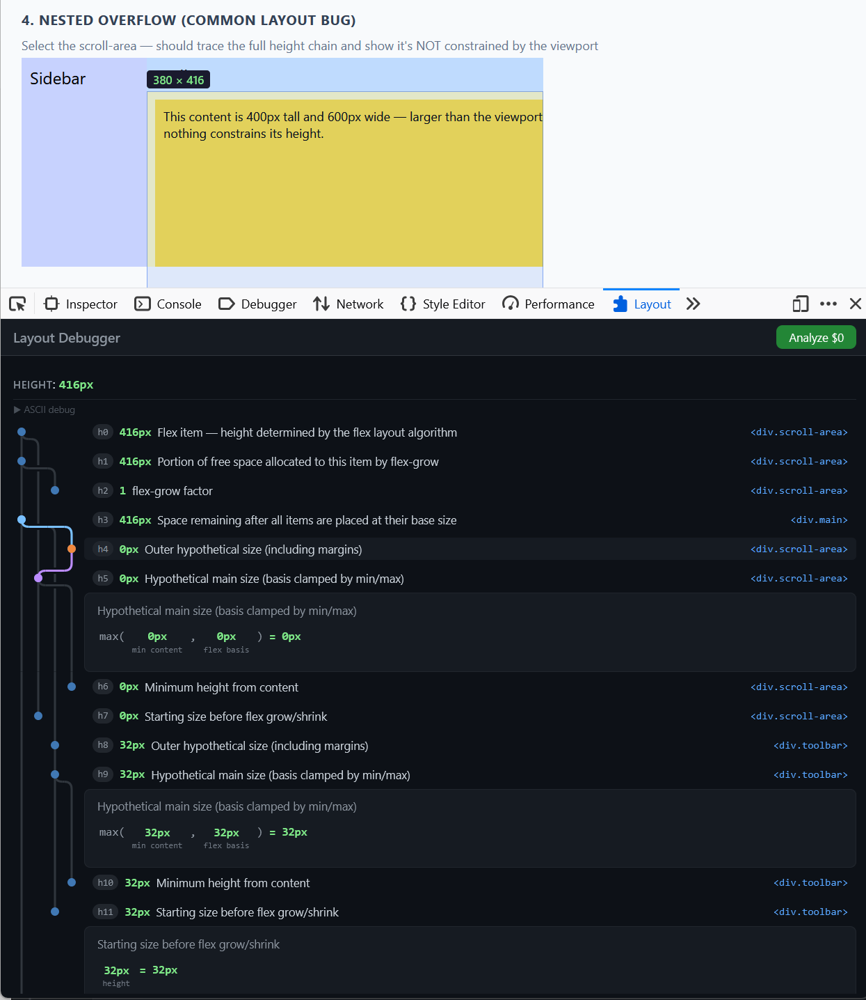

# Layout Debugger

A browser DevTools extension that explains **why** any HTML element has its current size. Select an element, and Layout Debugger traces the CSS layout algorithm to show exactly which properties, ancestors, and siblings contribute to the final width and height.



## Features

- **Full layout trace** -- builds a DAG (directed acyclic graph) of every value that feeds into an element's size: explicit dimensions, flex grow/shrink distribution, containing block chains, padding, border, margins, min/max constraints, aspect ratios, and more.
- **Interactive graph** -- SVG gutter visualization with topological ordering. Hover a node to highlight incoming/outgoing edges. Expand a node to see its calculation with labeled references and CSS property table.
- **Calculation display** -- each node shows a structured calculation with annotated values (referenced nodes, CSS properties, measured values) and a human-readable description.
- **Page overlay** -- hovering a node highlights the corresponding element on the page with a dimension label.
- **Collapse/expand** -- collapse subtrees to focus on the relevant part of the trace. Shared dependencies stay visible when reachable via other paths.
- **Bookmarklet** -- also available as a console tool (`whyThisSize($0)`) that logs the full trace.

## Supported layout modes

- Block (auto-width fill, content-sized height)
- Flex (single-line: basis, grow, shrink, free space distribution per CSS Flexbox SS9)
- Grid (track-based sizing, measured from browser)
- Positioned (absolute/fixed with opposing offsets)
- Aspect ratio (content-box and border-box per CSS Sizing 4)
- Percentage sizing
- Inline-block
- Min/max constraints (with box-sizing conversion)
- Content-sum and content-max (stacking children vs tallest child)

## Getting started

### Prerequisites

- Node.js 20+
- A Chromium-based browser (Chrome, Edge, Brave, etc.)

### Install dependencies

```sh
npm install
npx playwright install chromium
```

### Development

```sh
# Build the bookmarklet (IIFE bundle)
npm run build:dev

# Build the browser extension
npm run build:ext:dev

# Watch mode
npm run build:watch        # bookmarklet
npm run build:ext:watch    # extension
```

### Load the extension

1. Run `npm run build:ext:dev`
2. Open `chrome://extensions` (or equivalent)
3. Enable "Developer mode"
4. Click "Load unpacked" and select the `dist/extension/` directory
5. Open DevTools on any page -- the "Layout Debugger" panel appears

### Use the bookmarklet

1. Run `npm run build:dev`
2. Open `dist/layout-debugger.js` and paste its contents into the browser console, or load it as a script tag
3. Select an element in the Elements panel, then run `whyThisSize($0)`

## Testing

```sh
# Run all tests (DAG correctness + fuzz corpus regression)
npm test

# Run fuzz tests (random layout generation)
npm run test:fuzz

# Long fuzz run (1000 iterations)
npm run test:fuzz:long

# Custom fuzz run
FUZZ_N=5000 FUZZ_SEED=42 npx playwright test --project fuzz
```

The test suite includes:
- **DAG tests** -- verify the layout algorithm produces correct node kinds, values, and structure for hand-written fixtures
- **DAG layout tests** -- verify the graph visualization algorithm using ASCII art assertions (one markdown file per test case in `test/dag-layout/`)
- **Fuzz corpus** -- 380+ regression tests saved from fuzz runs, each a complete layout scenario with expected results

## Architecture

```
src/
  core/
    dag.ts            -- CalcExpr tree, LayoutNode, DagBuilder, NodeBuilder
    dag-layout.ts     -- Pure DAG layout algorithm (topological sort, column assignment, ASCII rendering)
    dag-render.ts     -- Linearizes a DagResult for display (topological order, CalcSegments)
    build-dag.ts      -- Entry point: builds the DAG for an element
    analyzers/
      block.ts        -- Block-fill and content-area sizing
      flex.ts         -- Flex item main/cross axis, sibling collection, length resolution
      grid.ts         -- Grid item sizing
      positioned.ts   -- Absolutely/fixed positioned elements
      aspect-ratio.ts -- Aspect ratio derivation
    units.ts          -- Dimension-map unit system (px, unitless, px^2, etc.)
    serialize.ts      -- DAG serialization and verification (fuzz oracle)
  extension/
    panel.ts          -- DevTools panel entry point, axis rendering, collapse/expand
    panel-types.ts    -- Shared types and constants
    panel-gutter.ts   -- Per-row SVG gutter tile rendering
    panel-highlight.ts-- Hover highlighting (graph edges + page overlay)
    engine.ts         -- Injected into inspected page, runs buildDag/renderDag
  bookmarklet/
    index.ts          -- Console tool entry point
test/
  dag-layout/         -- ASCII art test cases for graph visualization
  fuzz-corpus/        -- Saved fuzz regression tests
  fuzz/               -- Fuzz framework (generator, oracle, renderer)
```

## License

MIT
